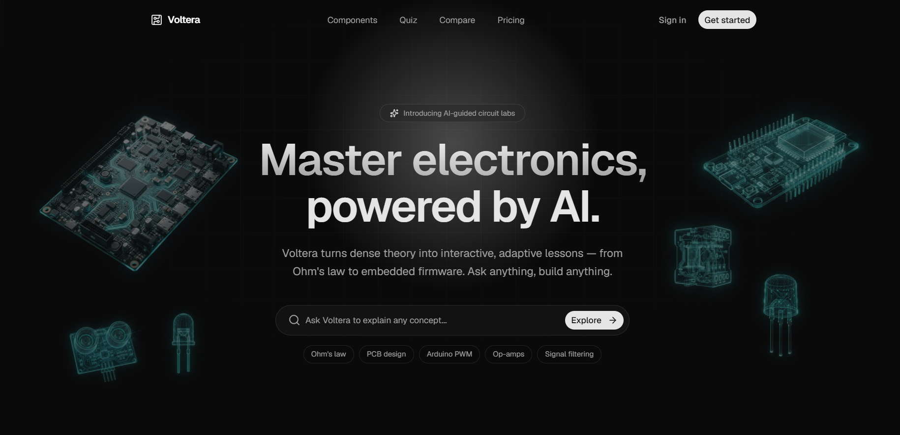
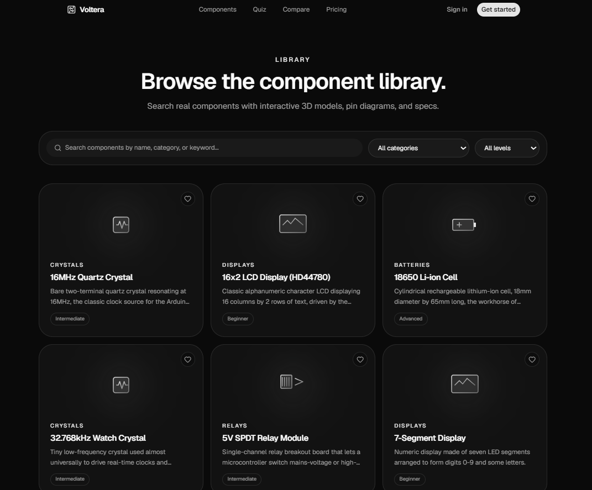
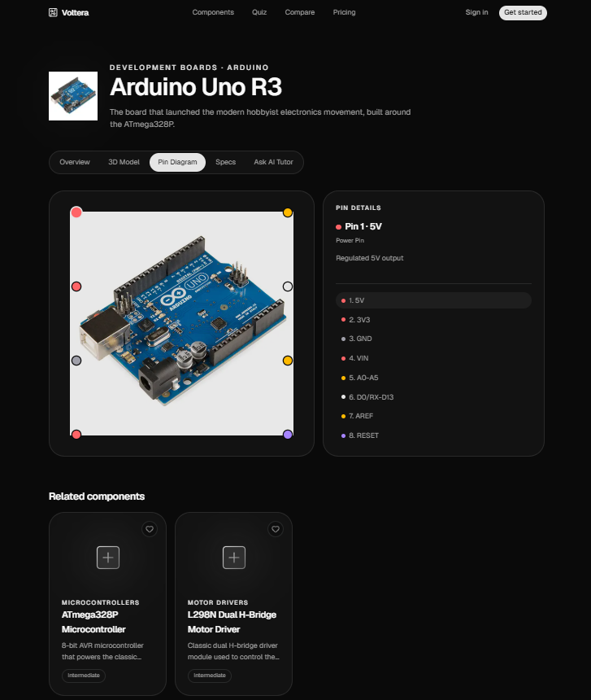
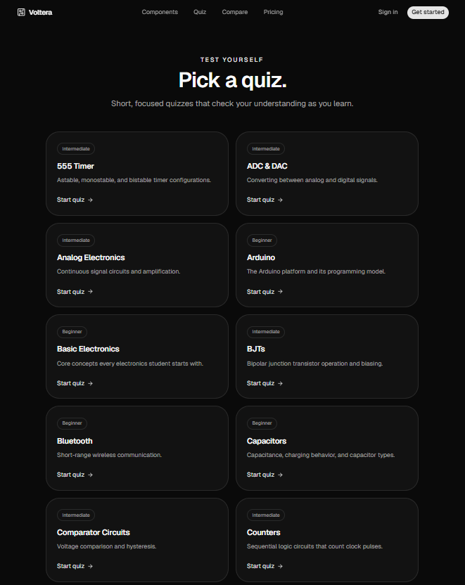
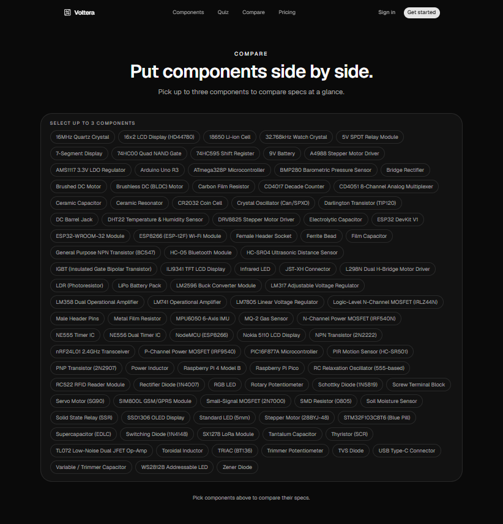

# Voltera — Learn Electronics with AI

Voltera turns dense electronics theory into an interactive, searchable reference: a curated
component encyclopedia with real specs and pin diagrams, short topic quizzes, a side-by-side
comparison tool, and an AI tutor that can answer questions about whatever component you're
looking at.

**Live app:** [voltera-studio.vercel.app](https://voltera-studio.vercel.app/)

---
# ✨ Features

- 🤖 AI Electronics Tutor
- 🔍 Smart Component Search
- 📚 Detailed Component Explorer
- ⚡ Fast & Responsive UI
- 🌙 Dark Modern Theme
- 📱 Mobile Friendly
- 💡 Beginner-Friendly Explanations
- 🔌 Embedded Systems Learning
- 
# 🛠 Tech Stack

### Frontend

- Next.js
- React
- TypeScript
- Tailwind CSS

### Backend

- Next.js API Routes

### AI

- Ollama
- Qwen2.5:3B

### Deployment

- Vercel

### Version Control

- Git
- GitHub

---

# 📂 Project Structure

```
Voltera/
│
├── app/
├── components/
├── lib/
├── public/
├── screenshots/
├── styles/
└── README.md
```

---


## Screenshots

### Landing page
Hero section with a live component search and quick-start topic suggestions.



### Component library
Searchable, filterable grid of every component in the catalog, filterable by category and
difficulty level.



### Component detail
Each component page includes an overview, an interactive 3D model, a clickable pin diagram,
full specs, and an "Ask AI Tutor" tab for that specific part — shown here on the pin diagram
tab for the Arduino Uno R3.



### Quiz
Short, focused multiple-choice quizzes per topic to check understanding as you learn.



### Compare
Pick up to three components and compare their specs side by side.



---

## Tech stack

- **Framework:** Next.js 16 (App Router), React 19, TypeScript
- **Styling:** Tailwind CSS
- **Database/Auth:** Supabase (Postgres + `@supabase/ssr`)
- **AI Tutor:** Google Gemini (`@google/genai`), streamed responses, Markdown rendering via
  `react-markdown` + `remark-gfm`

# 🚀 Installation

Clone the repository

```bash
git clone https://github.com/sanjibani-129/Voltera-Studio.git
```

Move into the project

```bash
cd Voltera-Studio
```

Install dependencies

```bash
npm install
```

Run locally

```bash
npm run dev
```

Open

```
http://localhost:3000
```

---

# 🤖 AI Tutor

The AI Tutor is powered locally using **Ollama**.

Install Ollama

```
https://ollama.com
```

Download the model

```bash
ollama pull qwen2.5:3b
```

Run

```bash
ollama serve
```

The tutor will then be available in the local development environment.


# 📈 Project Vision

Voltera aims to become an all-in-one AI learning platform for Electronics and Embedded Systems by combining structured educational resources with intelligent AI assistance to make technical learning simpler, faster, and more engaging.

---

# 👩‍💻 Author

**Sanjibani Saha**

Electronics & Communication Engineering Student

SRM University-AP

GitHub:
https://github.com/sanjibani-129

LinkedIn:
https://www.linkedin.com/in/sanjibani-saha-a6641b36a
## ⭐ Support

If you like this project,

⭐ Star the repository

🍴 Fork it

💙 Share it

---

Made with ❤️ using Next.js & AI.
